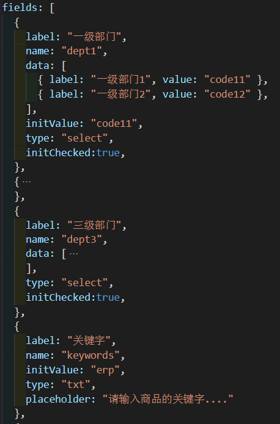
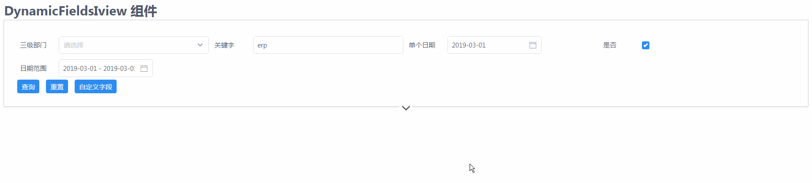

## dynamic-fields-iview





> 基于vue,iview。通过json格式的配置来生成查询表单

```
---------------------------           --------------------
- [                        -          -
-    {                     -          -
-        label:'姓名',      -         -   姓名: [      ]
-        name:'userName',  -          -
-        type: 'input'     -          -   性别: [      ]
-    },                    ---------> -
-    {                     -          -
-        label:'性别',     -          -         (查询) 
-        name:'userSex',   -          -
-        type: 'select'    -          -
-    }                     -          -
-]                         -          -  
----------------------------          --------------------- 
```

### 功能

- 根据配置生成 iview ui 表单元素。
- 支持自定义显示字段
- 支持本地保存设置


### 安装及使用

#### 1. 安装
``` bash
# install 
npm install dynamic-fields-iview 
```
#### 2. 装入组件
通过Vue.use 去装入组件
``` bash
# main.js
## must install vue, iview first
const dyi = require("dynamic-fields-iview")
Vue.use(dyi);
```
#### 3. 使用

``` bash
##  template
<DynamicFieldsIview 
    :pFieldsList="fields" 
    pStorageId="store1"
    @query="hQquery"
></DynamicFieldsIview>
```

### 参数说明

##### 1. pFieldsList
设置表单元素, dome如下。
```
[
    {
        label: "一级部门",
        name: "dept1",
        data: [
        { label: "一级部门1", value: "code11" },
        { label: "一级部门2", value: "code12" },
        ],
        initValue: "code11",
        type: "select",
        initChecked:true,
    },
    {
        label: "二级部门",
        name: "dept2",
        data: [
        { label: "二级部门1", value: "code21" },
        { label: "二级部门2", value: "code22" },
        { label: "二级部门3", value: "code23" }
        ],
        // filterable:true,
        // multiple :true,
        type: "select",
        initChecked:true,
    },
    {
        label: "三级部门",
        name: "dept3",
        data: [
        { label: "三级部门1", value: "code31" },
        { label: "三级部门2", value: "code32" }
        ],
        // clearable :true,
        type: "select",
        initChecked:true,
    },
    {
        label: "关键字",
        name: "keywords",
        initValue: "erp",
        type: "txt",
        placeholder: "请输入商品的关键字...."
    },
    {
        label: "单个日期",
        name: "date",
        type: "date",
        unit:"D",
        initValue: "2019-03-01",
    },
    {
        label: "是否",
        name: "deadline",
        type: "checkbox",
        initValue: true,
    },
    {
        label: "日期范围",
        name: "dateRange",
        data: "",
        type: "dateRange",
        unit:"D",
        initValue: ["2019-03-01","2019-03-03"]
    }
]

```

具体说明如下：

| 属性 | 类型 | 说明 | 
|------|------|------|
| label | String  | 必填。表单元素的说明性文字   |
| name | String  | 必填。表单元素的主键。   |
| type | String  | 必填。表单元素的类型。'date':日期；'select':下拉框   |
| initValue | String,Array,Boolean  | 表单元素的初始值。   |
| initChecked | Boolean  | 表单元素初始状态是否会显示出来。   |

#### 2. pStorageId

其值是一个字符串。如果设置了这个属性，将会开启本地存储来记录当前用户的选择。具体来说是：当点击了查询按钮之后，当前的字段信息（不是选中的值）会保存在本地。关闭页面再次打开时，会以最后一次保存的状态来设置表单。

注意：
- 如果你的项目中多次使用了本组件，并希望开启本地存储，请确保它们具有不同pStorageId。

#### 3. 事件query

当查询按钮被点击时，会向父组件抛出query事件，你只需要在外层去监听这个事件就行。它的payload由两个部分组成：
- cond : 用户选中的条件
- _el  : dynamic-fields-iview组件的引用。要注意的是_el.isQuery会决定查询按钮是否处于loading状态，需要在回调函数中去设置_el.isQuery为false。


```
methods:{
    hQquery({cond,_el}){
        console.info("query cond",cond);
        // 业务代码.....
        setTimeout(()=>{
            _el.isQuery = false
        },2000)
    }
}

```

#### 4. 自定义事件 @dept1Change="hDept1Change"

对于pFieldList中的每一项，当用户在界面中进行更改时，都会抛出对应的事件，事件名是 `Field.name+Change`

例如,有一个filed，它的name是keywords,则它抛出的事件名就是`keywordsChange`：
```
{
    label: "关键字",
    name: "keywords",
    initValue: "erp",
    type: "txt",
    placeholder: "请输入商品的关键字...."
}
```
它的payload是当前表单的选中值:

```
 <DynamicFieldsIview 
    :pFieldsList="fields" 
    pStorageId="store1"
    @query="hQquery"
    @keywordsChange="hKeywordsChange"
></DynamicFieldsIview>

methods:{
    hKeywordsChange(val){
        console.info("hKeywordsChange",val)
    }
}
```